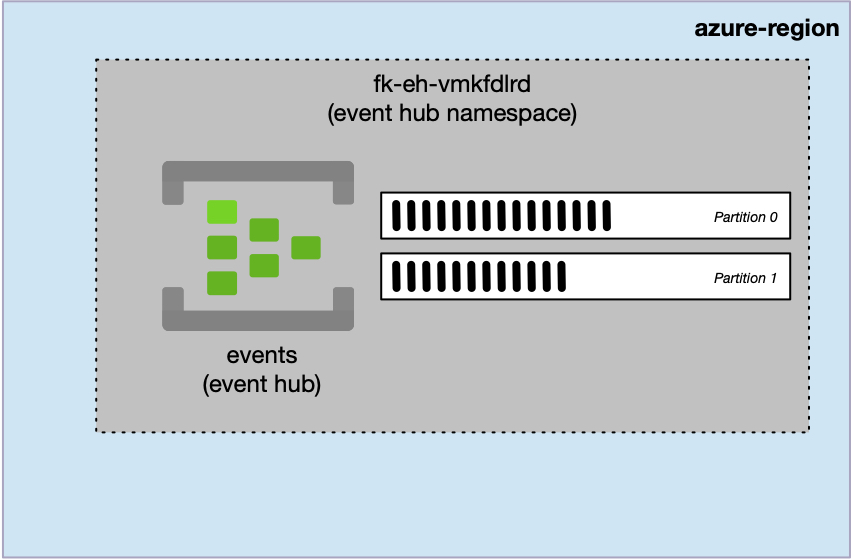
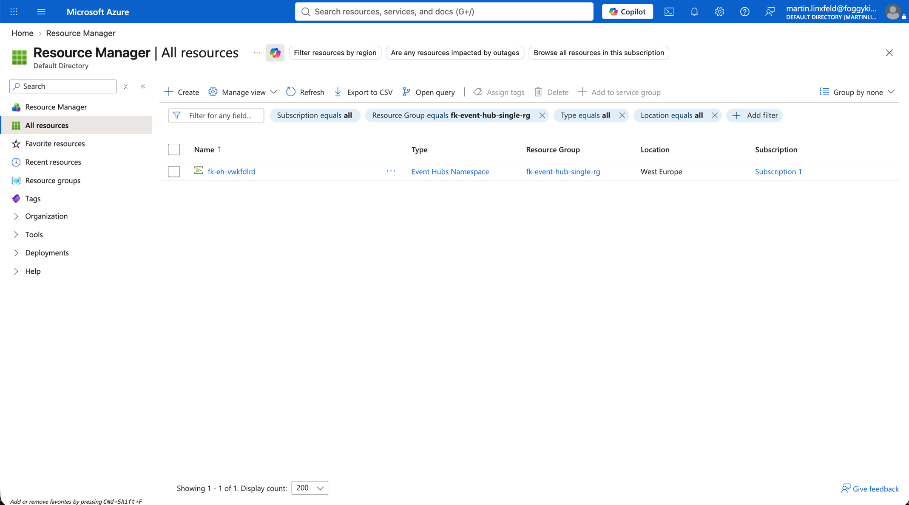
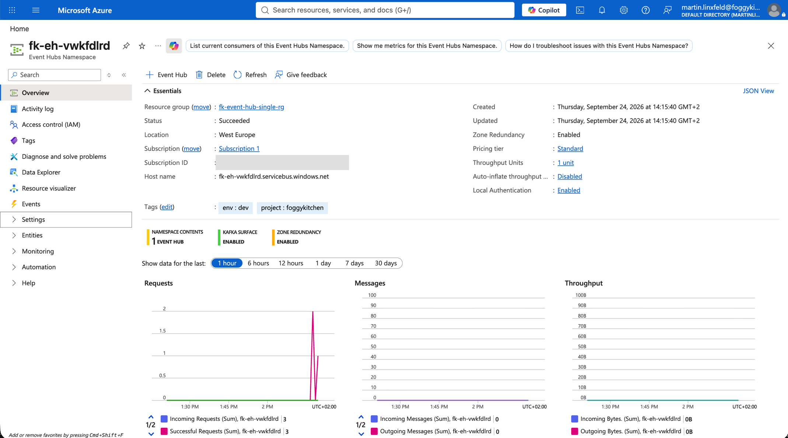
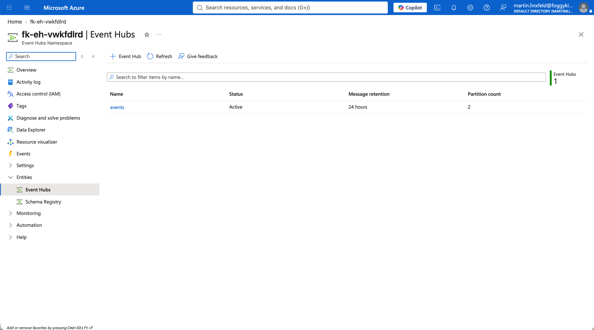
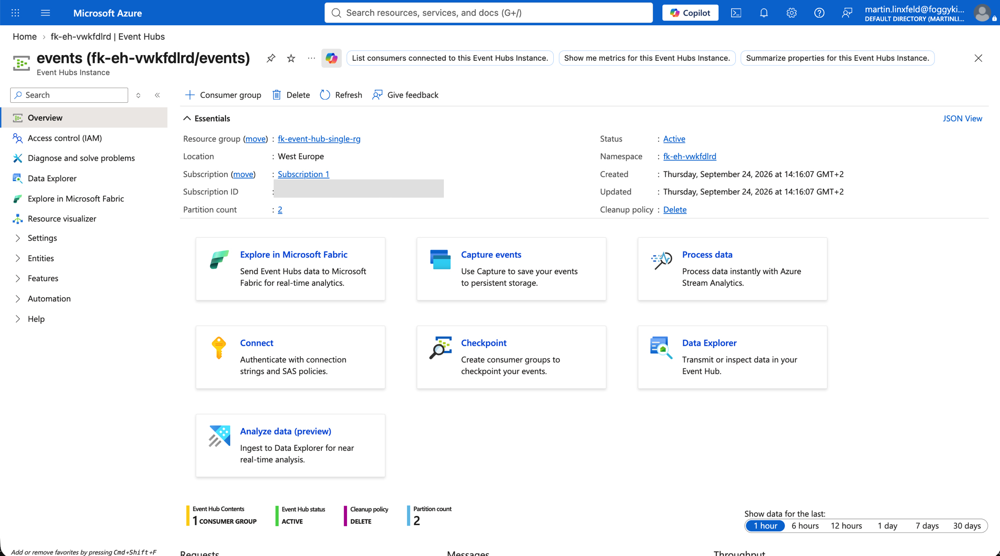
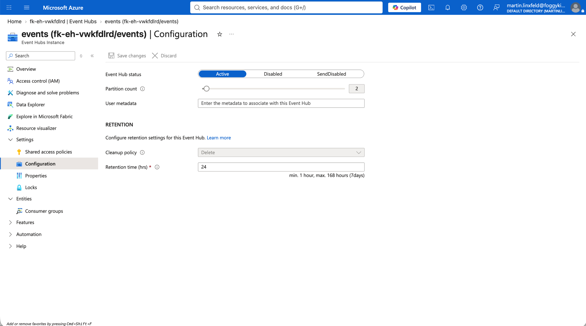
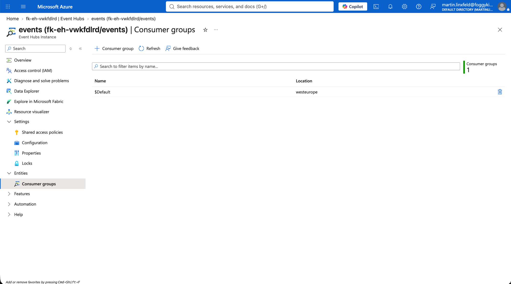

# Example 01: Single Event Hub

In this Azure Event Hubs example, we deploy one **Standard Event Hubs Namespace** and one Event Hub using **Terraform/OpenTofu**.
The local Event Hubs module owns only the namespace and the Event Hub within it.

This example is the direct Azure counterpart to the OCI Streaming `01_single_stream` example.

---

## Architecture Overview



*Figure 1. A Standard Event Hubs Namespace contains the `events` Event Hub, which distributes its event stream across two partitions.*

This deployment creates:

- A dedicated **Azure Resource Group**
- One **Standard Event Hubs Namespace** with one throughput unit
- One Event Hub named `events`
- Two partitions for parallel ingestion and consumption
- One day of event retention

The Event Hubs module does not create publishers, consumers, non-default Consumer Groups, networking, Private Endpoints, Capture storage, or RBAC assignments.

---

## Event Hubs Layout

- **Namespace tier:** `Standard`
- **Namespace capacity:** `1` throughput unit
- **Event Hub:** `events`
- **Partition count:** `2`
- **Message retention:** `1` day
- **Consumer Groups:** Azure-provided `$Default` only

Standard is the general-purpose tier for application event pipelines. Unlike Basic, it supports multiple Consumer Groups, Kafka, Capture, and up to seven days of retention while avoiding Premium's processing-unit cost model.

---

## Deployment Steps

```bash
cp terraform.tfvars.example terraform.tfvars
tofu init
tofu plan
tofu apply
```

The variables file contains only the Resource Group name, Azure region, and tags. It contains no password, token, connection string, shared access key, or other secret.

After deployment, OpenTofu outputs the namespace ID and name plus a map from the Event Hub's logical name to its resource ID.

---

## Runtime Notes

The random suffix makes the namespace name globally unique. Azure Event Hubs Namespace names are globally unique because they form part of the service endpoint.

Applications must be composed separately. Grant a publisher identity `Azure Event Hubs Data Sender` and a consumer identity `Azure Event Hubs Data Receiver` at the appropriate scope. This example intentionally creates neither identity nor role assignment.

Two partitions allow parallel readers, but partition count should be chosen for expected throughput and consumer concurrency. Outside Premium or Dedicated namespaces, Azure restricts changing the partition count after creation, and partition counts cannot be decreased.

---

## Azure Console Verification

### Resource Group Overview

The dedicated Resource Group contains one Event Hubs Namespace in West Europe. Event Hubs are child resources of the namespace and therefore do not appear as separate Resource Group resources.



*Figure 2. Resource Group contents showing the single Event Hubs Namespace created by the example.*

### Event Hubs Namespace

The namespace overview confirms a successful deployment in West Europe using the Standard pricing tier and one throughput unit. It also reports one Event Hub within the namespace.



*Figure 3. Deployed Standard Event Hubs Namespace with one throughput unit and one Event Hub.*

### Event Hub List

The namespace contains one active Event Hub named `events`. The list view confirms its 24-hour retention period and two partitions.



*Figure 4. The active `events` Event Hub with 24-hour retention and two partitions.*

### Event Hub Overview

The Event Hub overview confirms that `events` belongs to the expected namespace, is active, uses the Delete cleanup policy, and exposes two partitions.



*Figure 5. Event Hub overview showing active status, namespace membership, Delete cleanup policy, and two partitions.*

### Partition And Retention Configuration

The configuration view verifies the two-partition layout and the 24-hour retention period. The portal also shows the current Standard-tier retention range of one hour through seven days.



*Figure 6. Event Hub configuration with two partitions and 24-hour message retention.*

### Default Consumer Group

Azure creates the `$Default` Consumer Group automatically. No additional Consumer Group is provisioned by this module, preserving the separation between Event Hubs infrastructure and consumer-specific state.



*Figure 7. The Azure-provided `$Default` Consumer Group with no module-managed Consumer Groups.*

The example was deployed and verified against Azure on 2026-09-24. This verification confirms resource provisioning and configuration; no publisher or consumer workload was attached and no runtime event was published.

---

## Cleanup

```bash
tofu destroy
```

---

## Summary

This example demonstrates:

- A minimal Standard Event Hubs Namespace
- One explicitly configured Event Hub
- Independent partition and retention settings
- Secret-free configuration and outputs
- Separation of Event Hubs infrastructure from publishers, consumers, identity, and networking

---

## Learn More

Visit [FoggyKitchen.com](https://foggykitchen.com/) for Azure, OCI, multicloud, and Terraform/OpenTofu learning resources.

---

## License

Licensed under the **Universal Permissive License (UPL), Version 1.0**.
See [LICENSE](../../LICENSE) for more details.

---

© 2026 [FoggyKitchen.com](https://foggykitchen.com) - Cloud. Code. Clarity.
