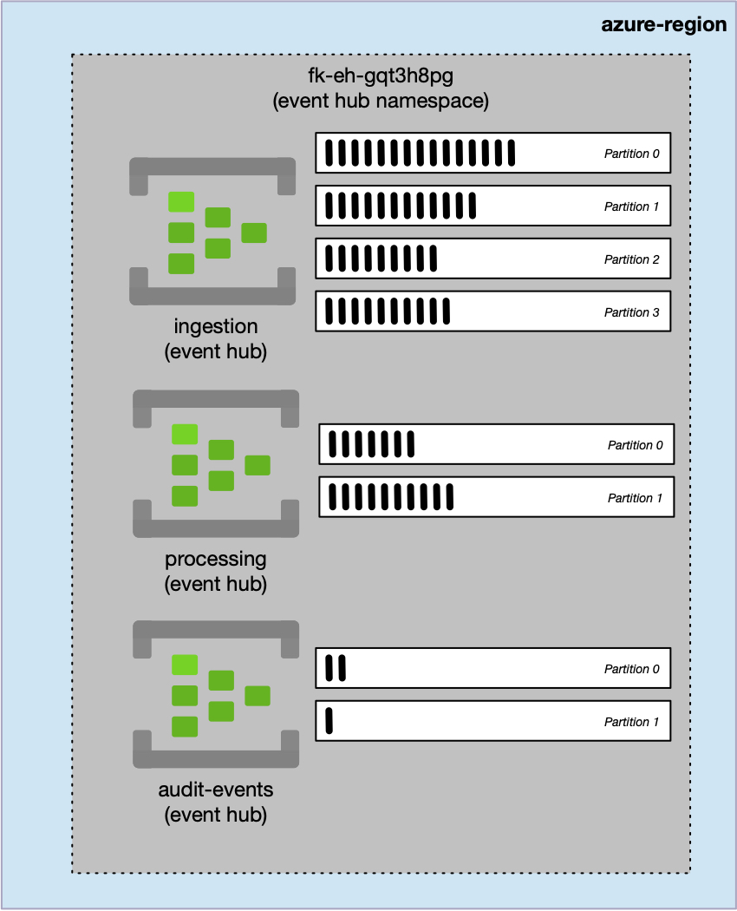
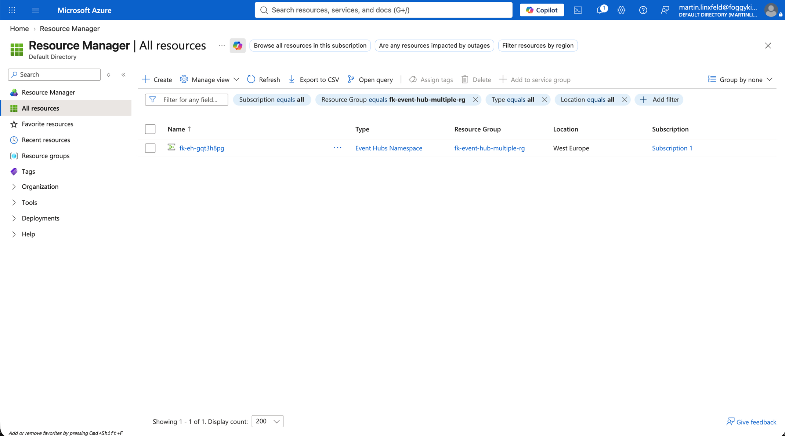
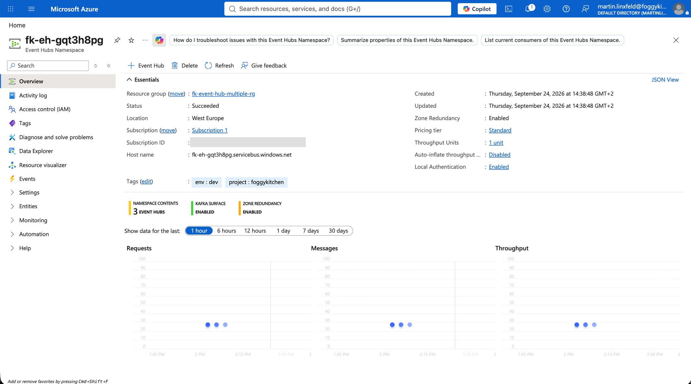
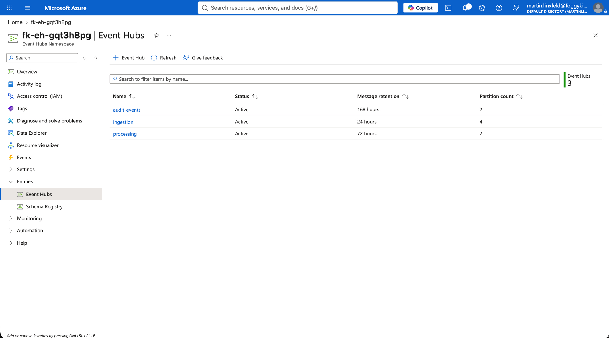
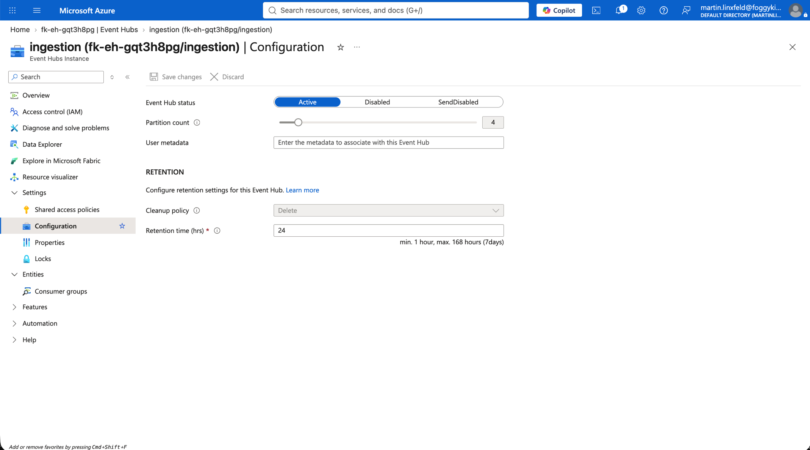
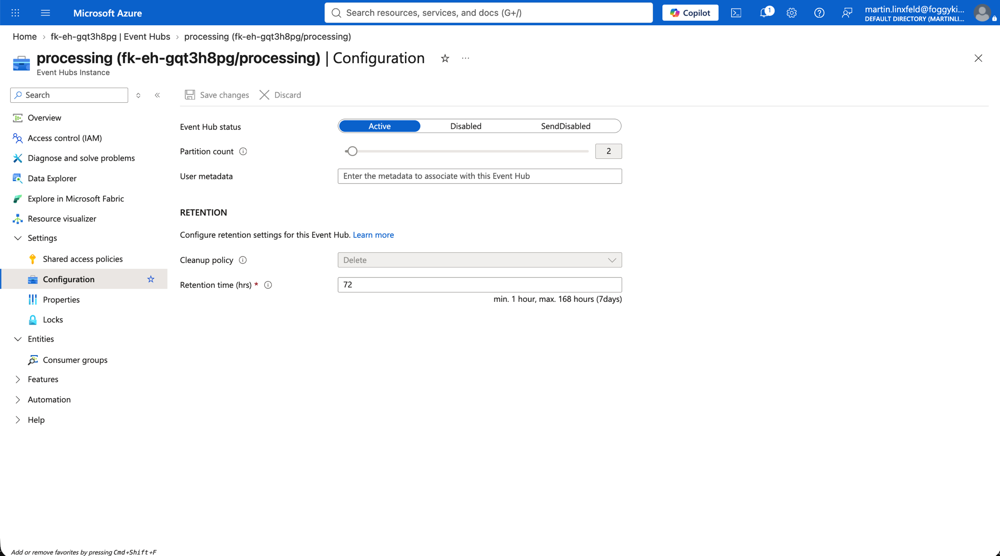
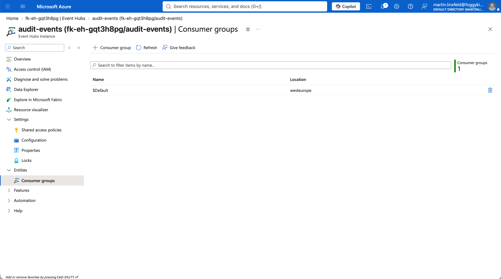

# Example 02: Multiple Event Hubs

In this Azure Event Hubs example, we deploy one **Standard Event Hubs Namespace** with three Event Hubs using **Terraform/OpenTofu**.
The local Event Hubs module owns only the namespace and the Event Hubs within it.

This example is the direct Azure counterpart to the OCI Streaming `02_multiple_streams` example and expands Example 01 into a simple multi-stream pipeline layout.

---

## Architecture Overview



*Figure 1. One Event Hubs Namespace contains separate ingestion, processing, and audit Event Hubs with independent partition layouts.*

This deployment creates:

- A dedicated **Azure Resource Group**
- One **Standard Event Hubs Namespace** with one throughput unit
- One `ingestion` Event Hub for incoming high-volume events
- One `processing` Event Hub for downstream pipeline handoff
- One `audit-events` Event Hub using an explicit Azure name override

The Event Hubs module does not create publishers, consumers, non-default Consumer Groups, networking, Private Endpoints, Capture storage, or RBAC assignments.

---

## Event Hubs Layout

| Logical key | Azure name | Partitions | Retention |
|-------------|------------|-----------:|----------:|
| `ingestion` | `ingestion` | 4 | 1 day |
| `processing` | `processing` | 2 | 3 days |
| `audit` | `audit-events` | 2 | 7 days |

- **Namespace tier:** `Standard`
- **Namespace capacity:** `1` throughput unit
- **Consumer Groups:** Azure-provided `$Default` only

The seven-day audit retention demonstrates the current Standard-tier maximum. Longer retention requires Premium or Dedicated, or Event Hubs Capture to separately composed storage.

---

## Deployment Steps

```bash
cp terraform.tfvars.example terraform.tfvars
tofu init
tofu plan
tofu apply
```

The variables file contains only the Resource Group name, Azure region, and tags. It contains no password, token, connection string, shared access key, or other secret.

After deployment, OpenTofu outputs the namespace ID and name plus resolved metadata for each Event Hub, keyed by its stable logical name.

---

## Runtime Notes

The random suffix makes the namespace name globally unique. All Event Hubs share namespace-level throughput capacity, while partition counts and message retention are configured independently per Event Hub.

The `audit` logical key resolves to the explicit Azure resource name `audit-events`; the other Event Hubs use their logical keys as names. Stable logical keys let downstream compositions select resources without depending on display-name overrides.

Applications and access control must be composed separately. Grant publisher and consumer identities the appropriate Event Hubs data-plane roles. Create non-default Consumer Groups alongside the consuming workload because they represent consumer-specific lifecycle state.

---

## Azure Console Verification

### Resource Group Overview

The dedicated Resource Group contains one Event Hubs Namespace in West Europe. The three Event Hubs are child resources of that namespace and do not appear as separate Resource Group resources.



*Figure 2. Resource Group contents showing the shared Event Hubs Namespace created by the example.*

### Event Hubs Namespace

The namespace overview confirms a successful deployment using the Standard pricing tier and one throughput unit. The namespace contents summary reports all three Event Hubs.



*Figure 3. Deployed Standard Event Hubs Namespace with one throughput unit and three Event Hubs.*

### Event Hub List

The namespace contains the three active Event Hubs defined by the input map. The list view confirms the independent retention periods and partition counts for `audit-events`, `ingestion`, and `processing`.



*Figure 4. Three active Event Hubs with retention periods of 168, 24, and 72 hours and partition counts of two, four, and two respectively.*

### Ingestion Event Hub

The `ingestion` Event Hub uses four partitions to demonstrate greater parallelism at the pipeline entry point and retains events for 24 hours.



*Figure 5. Ingestion Event Hub configuration with four partitions and 24-hour message retention.*

### Processing Event Hub

The `processing` Event Hub uses two partitions and retains events for 72 hours, providing a separate channel for downstream pipeline handoff.



*Figure 6. Processing Event Hub configuration with two partitions and 72-hour message retention.*

### Audit Event Hub

The `audit` logical input key resolves to the explicit Azure resource name `audit-events`. It uses two partitions and the Standard tier's maximum retention period of 168 hours.


*Figure 7. Audit Event Hub configuration with two partitions and 168-hour message retention.*

### Default Consumer Group

Azure creates the `$Default` Consumer Group automatically for each Event Hub. The screenshot uses `audit-events` to verify that no additional Consumer Group is provisioned by this module.



*Figure 8. The Azure-provided `$Default` Consumer Group with no module-managed Consumer Groups.*

The example was deployed and verified against Azure on 2026-09-24. This verification confirms resource provisioning and configuration; no publisher or consumer workload was attached and no runtime event was published.

---

## Cleanup

```bash
tofu destroy
```

---

## Summary

This example demonstrates:

- Multiple Event Hubs sharing one namespace
- Map-based Event Hub creation with stable logical keys
- Per-hub partition and retention settings
- An optional Azure resource-name override
- Separation of buffering infrastructure from publishers, consumers, identity, and networking

---

## Learn More

Visit [FoggyKitchen.com](https://foggykitchen.com/) for Azure, OCI, multicloud, and Terraform/OpenTofu learning resources.

---

## License

Licensed under the **Universal Permissive License (UPL), Version 1.0**.
See [LICENSE](../../LICENSE) for more details.

---

© 2026 [FoggyKitchen.com](https://foggykitchen.com) - Cloud. Code. Clarity.
